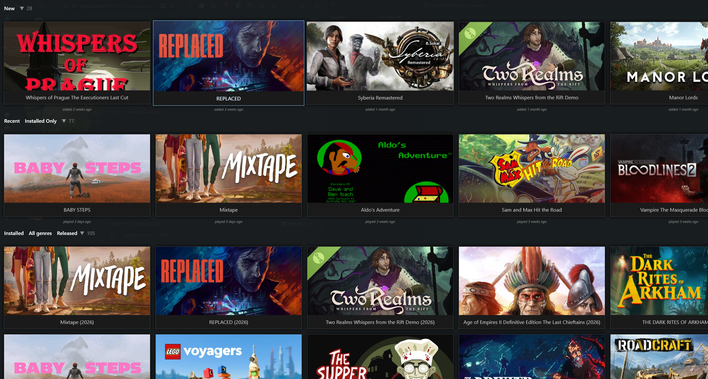

# naLauncher2

A WPF-based personal game launcher for Windows. Manages a local library of game shortcuts, enriches game metadata from external sources, and presents everything in an animated dark-themed UI.



## Features

- **Game library** — tracks games via shortcuts (`.lnk`, `.exe`, `.url`, `.cmd`, `.bat`), persisted as a JSON file
- **Sections** — *New Games* (installed, never played), *Recent Games* (last played), *All Games* (full filterable/sortable grid)
- **Filtering** — Installed · Removed · Completed · Missing Data · Steam · IGDB · All; additionally by genre
- **Sorting** — Title · Date Added · Date Completed · Play Count · Rating · Release Date (ascending/descending)
- **Metadata enrichment** — fetches cover art, summary, genres, developer, rating and release date from **IGDB** and **Steam**
- **Image cache** — resolves missing covers from a local image directory
- **Backup / restore** — compressed (GZip) `.bak` snapshots, keeps the 10 most recent
- **Animated UI** — momentum-based horizontal scroll for New/Recent sections, animated game placement

## Requirements

- Windows 10 or later
- [.NET 10 Runtime](https://dotnet.microsoft.com/download/dotnet/10.0)
- `Ujeby.Core.dll` placed at `..\..\Ujeby\publish\Ujeby.Core.dll` relative to the solution root

## Building

```powershell
dotnet build naLauncher2.slnx
```

## Configuration

Settings are stored in `settings.json` next to the executable and are edited via the in-app **Settings** dialog.

| Setting | Description |
|---|---|
| `LibraryPath` | Path to the game library JSON file |
| `Sources` | Directories scanned for game shortcuts |
| `TopLevelOnly` | Scan only the top level of each source directory |
| `GameExtensions` | File extensions to treat as game shortcuts (default: `.lnk .exe .url .cmd .bat`) |
| `ImageCachePath` | Directory containing pre-downloaded cover images (matched by file name) |
| `LogPath` | Custom log file path (defaults to app directory) |
| `TwitchDev.ClientId` / `TwitchDev.ClientSecret` | [Twitch Developer](https://dev.twitch.tv/console) credentials required for IGDB metadata |

### Twitch / IGDB setup

1. Register an application at <https://dev.twitch.tv/console>.
2. Copy the **Client ID** and **Client Secret** into the Settings dialog (or directly into `settings.json`).

## Dependencies

| Package | Version |
|---|---|
| [PuppeteerSharp](https://github.com/hardkoded/puppeteer-sharp) | 24.40.0 |
| Ujeby.Core | local reference |

## License

Private / personal use.
