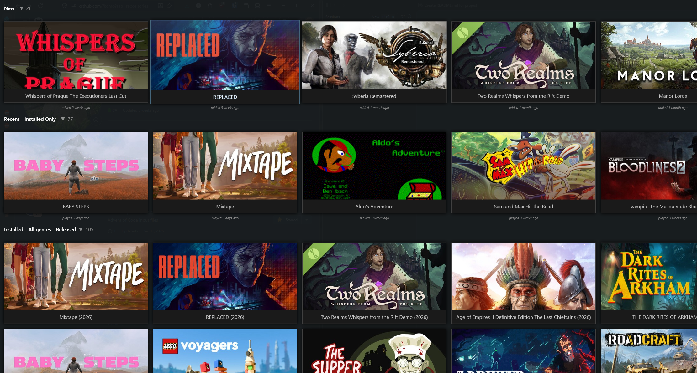

# naLauncher2

A WPF-based personal game launcher for Windows. Manages a local library of game shortcuts, enriches game metadata from external sources, and presents everything in an animated dark-themed UI.



## Features

- **Game library** — tracks games via shortcuts (`.lnk`, `.exe`, `.url`, `.cmd`, `.bat`), persisted as a JSON file
- **Sections** — *New Games* (installed, never played), *Recent Games* (last played), *All Games* (full filterable/sortable grid)
- **Filtering** — Installed · Removed · Completed · Missing Data · Steam · IGDB · All; additionally by genre
- **Sorting** — Title · Date Added · Date Completed · Play Count · Play Time · Rating · Release Date (ascending/descending), optionally split into groups
- **Playtime tracking** — follows each launched game until it exits (Job Object for direct launches, Steam's running flag, or the install folder), adds the playtime Steam and GOG Galaxy recorded without counting anything twice, and keeps tracking from the tray when the window is closed; sessions can be edited in the game's properties
- **Metadata enrichment** — fetches cover art, summary, genres, developer, rating and release date from **IGDB** and **Steam**
- **Image cache** — resolves missing covers from a local image directory
- **Backup / restore** — compressed (GZip) `.bak` snapshots, keeps the 10 most recent
- **Animated UI** — momentum-based horizontal scroll for New/Recent sections, animated game placement

## Requirements

- Windows 10 or later
- [.NET 10 Runtime](https://dotnet.microsoft.com/download/dotnet/10.0)

## Building

```powershell
dotnet build src/naLauncher2.slnx
```

## Configuration

Settings are stored in `settings.json` next to the executable and are edited via the in-app **Settings** dialog.

| Setting | Description |
|---|---|
| `LibraryPath` | Path to the game library JSON file |
| `Sources` | Directories scanned for game shortcuts |
| `TopLevelOnly` | Scan only the top level of each source directory |
| `GameExtensions` | File extensions to treat as game shortcuts (default: `.lnk .exe .url .cmd .bat`) |
| `ImageCachePath` | Directory containing pre-downloaded cover images (matched by file name) |
| `MinSessionDurationSeconds` | Tracked sessions shorter than this are discarded (default 60) |
| `LogPath` | Directory for `naLauncher2.log`; when empty, nothing is logged to a file |
| `TwitchDev.ClientId` / `TwitchDev.ClientSecret` | [Twitch Developer](https://dev.twitch.tv/console) credentials required for IGDB metadata |

### Twitch / IGDB setup

1. Register an application at <https://dev.twitch.tv/console>.
2. Copy the **Client ID** and **Client Secret** into the Settings dialog (or directly into `settings.json`).

## Dependencies

Two projects: `naLauncher2.Core` (library, settings, metadata providers) and `naLauncher2.Wpf` (the UI). Package versions are managed centrally in `src/Directory.Packages.props`.

| Package | Version |
|---|---|
| [Microsoft.Data.Sqlite](https://www.nuget.org/packages/Microsoft.Data.Sqlite) | 10.0.12 |
| [PuppeteerSharp](https://github.com/hardkoded/puppeteer-sharp) | 24.40.0 |
| System.Drawing.Common | 10.0.0 |

## License

Private / personal use.
